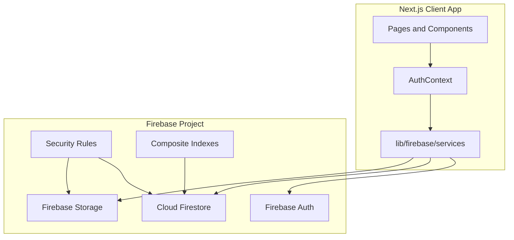
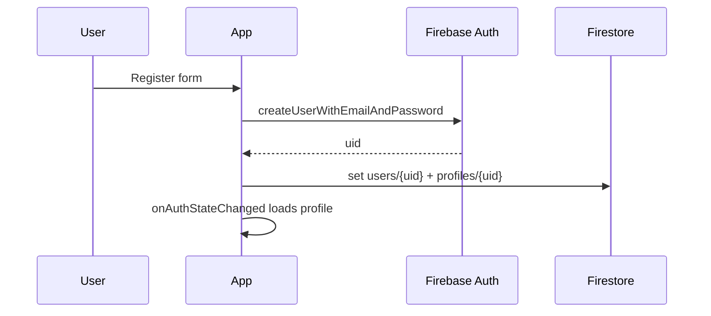

# Firebase Backend & Development Plan — UK Matrimony

## 1. Current State Summary

The app is a **fully client-side Next.js 16 prototype** with no server API. All persistence is **localStorage** + **mock data** in [`lib/mock/`](lib/mock/).

| Domain | Current implementation | Firebase target |
|--------|------------------------|-----------------|
| Auth (login/register) | [`lib/auth.ts`](lib/auth.ts) + [`context/AuthContext.tsx`](context/AuthContext.tsx) | Firebase Authentication |
| Profiles | [`lib/types/index.ts`](lib/types/index.ts) `Profile` type, session-only | Firestore `profiles` + `users` |
| Search | [`lib/mock/profiles.ts`](lib/mock/profiles.ts) + [`lib/search-filters.ts`](lib/search-filters.ts) client filter | Firestore queries + client refinement |
| Match scoring | [`lib/matchmaking/calculateMatchScore.ts`](lib/matchmaking/calculateMatchScore.ts) (client) | Keep client-side (no backend needed) |
| Interests | [`lib/mock/interests.ts`](lib/mock/interests.ts) | Firestore `interests` |
| Favorites | [`lib/onboarding/favorites.ts`](lib/onboarding/favorites.ts) localStorage | Firestore `favorites` subcollection |
| Messaging | [`lib/mock/messages.ts`](lib/mock/messages.ts) | Firestore `conversations` + `messages` (real-time) |
| Verification | localStorage queue in [`lib/auth.ts`](lib/auth.ts) | Firestore `verificationRequests` + Storage docs |
| Subscriptions | [`lib/mock/plans.ts`](lib/mock/plans.ts) UI only | Firestore `subscriptions` (Stripe Extension later) |
| Admin portal | [`lib/admin-auth.ts`](lib/admin-auth.ts) hardcoded credentials | Firebase Auth + custom claims `role: admin` |
| Onboarding gates | [`lib/onboarding/access.ts`](lib/onboarding/access.ts) | Unchanged — driven by `profile.onboardingStatus` from Firestore |
| Photos/docs | Unsplash URLs / base64 previews | Firebase Storage |

**Deployment recommendation:** Keep **static export** + **Firebase Hosting** (matches your no-custom-backend constraint, lowest cost, simplest ops). Refactor `/search/[id]` to a **client-fetched profile page** because static export cannot serve unlimited dynamic Firestore user IDs at build time.

---

## 2. Firebase Architecture



**Firebase products used (no custom Node/Python server):**
- **Authentication** — email/password; phone OTP for verification step
- **Cloud Firestore** — all structured data
- **Firebase Storage** — profile photos + verification documents
- **Security Rules** — authorization (replaces server-side auth checks)
- **Firebase Hosting** — static Next.js export
- **Optional later:** Firebase Extensions (Stripe payments, Trigger Email for contact form)

---

## 3. Firestore Schema Design

Document IDs use **Firebase Auth UID** for user-owned documents unless noted.

### 3.1 `users/{uid}`

Lightweight account record (Auth holds credentials; never store passwords).

```typescript
{
  email: string;
  name: string;
  role: "member" | "admin";           // admin via custom claim mirror
  accountStatus: "active" | "suspended" | "deleted";
  createdAt: Timestamp;
  updatedAt: Timestamp;
  lastActiveAt: Timestamp;
}
```

### 3.2 `profiles/{uid}`

Maps to existing [`Profile`](lib/types/index.ts) + denormalized search fields.

```typescript
{
  // Identity (denormalized from users for search cards)
  displayName: string;
  email: string;                       // hidden from other users via rules

  // Demographics (from Profile)
  yearOfBirth: number;
  birthMonth: number;
  birthDay?: number;
  age: number;                         // computed on write, indexed for queries
  gender: "male" | "female" | "other";
  lookingFor: "bride" | "groom";
  heightCm: number;
  weightKg: number;
  bodyType: string;
  location: string;
  country?: string;
  state?: string;
  city?: string;
  religion: string;
  motherTongue?: string;
  caste?: string;
  education: string;
  college?: string;
  occupation: string;
  company?: string;
  annualIncome?: string;
  maritalStatus: string;
  bio: string;

  // Media — Storage download URLs (not base64)
  photos: string[];                    // max 6
  primaryPhotoUrl: string;             // denormalized for cards

  // Nested objects (match existing types)
  privacySettings: { hidePhoto, hideContact, hideProfile };
  preferences: PartnerPreferences;
  matrimony: MatrimonyDetails;         // partial until onboarding complete

  // Verification summary (sensitive doc paths in verificationRequests)
  verification: {
    phone?: string;
    phoneVerified: boolean;
    emailVerified: boolean;
    idDocumentType?: string;
    submittedAt?: Timestamp;
    rejectionReason?: string;
  };

  // Status & gating (drives canAccess() in access.ts)
  onboardingStatus: OnboardingStatus;
  verified: boolean;
  profileCompletion: number;           // computed on write

  // Search indexing helpers
  searchVisibility: boolean;           // !privacySettings.hideProfile
  genderLookingFor: string;            // e.g. "male-seeking-bride" for compound queries

  memberSince: Timestamp;
  lastActiveAt: Timestamp;
  updatedAt: Timestamp;
}
```

### 3.3 `interests/{interestId}`

```typescript
{
  fromUserId: string;
  toUserId: string;
  status: "pending" | "accepted" | "declined";
  message?: string;                    // optional intro note
  createdAt: Timestamp;
  updatedAt: Timestamp;

  // Denormalized for dashboard lists
  fromUserName: string;
  fromUserPhoto: string;
  toUserName: string;
  toUserPhoto: string;
}
```

**Indexes:** `(toUserId, status, createdAt desc)`, `(fromUserId, status, createdAt desc)`

### 3.4 `users/{uid}/favorites/{profileId}`

Subcollection (replaces localStorage favorites).

```typescript
{
  profileId: string;
  createdAt: Timestamp;
  // denormalized snapshot for offline list display
  profileName: string;
  profilePhoto: string;
  profileAge: number;
  profileLocation: string;
}
```

### 3.5 `conversations/{conversationId}`

`conversationId` = deterministic ID: `[uidA, uidB].sort().join("_")`

```typescript
{
  participantIds: [string, string];
  participantMeta: {
    [uid: string]: { name: string; photo: string };
  };
  lastMessage: string;
  lastMessageAt: Timestamp;
  lastSenderId: string;
  unreadCount: { [uid: string]: number };
  createdAt: Timestamp;
  updatedAt: Timestamp;
}
```

### 3.6 `conversations/{conversationId}/messages/{messageId}`

```typescript
{
  fromUserId: string;
  toUserId: string;
  content: string;
  timestamp: Timestamp;
  read: boolean;
  readAt?: Timestamp;
}
```

**Real-time:** `onSnapshot` on messages subcollection ordered by `timestamp`.

### 3.7 `verificationRequests/{uid}`

One active request per user (doc ID = uid).

```typescript
{
  userId: string;
  userName: string;
  userEmail: string;
  status: "pending" | "approved" | "rejected";
  idDocumentType: IdDocumentType;
  storagePaths: {
    idDocument: string;              // Storage path, not public URL
    selfie: string;
    educationDoc?: string;
    employmentDoc?: string;
  };
  phone: string;
  phoneVerified: boolean;
  emailVerified: boolean;
  submittedAt: Timestamp;
  reviewedAt?: Timestamp;
  reviewedBy?: string;               // admin uid
  rejectionReason?: string;
}
```

### 3.8 `reports/{reportId}`

```typescript
{
  reporterId: string;
  reportedId: string;
  reporterName: string;
  reportedName: string;
  reason: string;
  details?: string;
  status: "open" | "reviewing" | "resolved";
  resolution?: string;
  createdAt: Timestamp;
  updatedAt: Timestamp;
}
```

### 3.9 `subscriptions/{uid}`

```typescript
{
  userId: string;
  planId: "free" | "premium" | "platinum";
  billing: "monthly" | "yearly";
  status: "active" | "cancelled" | "expired" | "trialing";
  amount: number;
  currency: "GBP";
  stripeCustomerId?: string;           // Phase 2
  stripeSubscriptionId?: string;
  currentPeriodStart: Timestamp;
  currentPeriodEnd: Timestamp;
  createdAt: Timestamp;
  updatedAt: Timestamp;
}
```

### 3.10 `subscriptionPlans/{planId}` (optional seed)

Mirror [`lib/mock/plans.ts`](lib/mock/plans.ts) for admin-editable pricing. Can stay in code initially.

### 3.11 `platformStats/aggregate` (optional)

Denormalized counters for admin dashboard (updated via batched writes on key events) to avoid expensive count queries:

```typescript
{
  totalUsers: number;
  verifiedProfiles: number;
  pendingVerifications: number;
  openReports: number;
  premiumMembers: number;
  updatedAt: Timestamp;
}
```

### 3.12 `contactSubmissions/{id}` (optional)

For [`app/contact/page.tsx`](app/contact/page.tsx) form — currently no backend.

```typescript
{ name, email, subject, message, createdAt, status: "new" | "read" }
```

---

## 4. Firebase Storage Layout

```
gs://{bucket}/
├── profile-photos/
│   └── {uid}/
│       ├── {photoId}.jpg          # public to authenticated members
│       └── thumb_{photoId}.jpg    # optional resized thumbnail
├── verification-docs/
│   └── {uid}/
│       ├── id-document.{ext}      # private — admin + owner only
│       ├── selfie.{ext}
│       ├── education.{ext}
│       └── employment.{ext}
└── public/
    └── marketing/                  # static marketing assets (optional)
```

| Asset | Max size | Who reads | Who writes |
|-------|----------|-----------|------------|
| Profile photos | 5 MB, JPEG/PNG/WebP | Authenticated members (respect `hidePhoto` in Firestore, not Storage rules) | Owner only |
| ID/selfie docs | 10 MB | Owner + admins | Owner during verification |
| Optional docs | 10 MB PDF/JPEG | Owner + admins | Owner |

**Privacy pattern for `hidePhoto`:** Storage allows authenticated read; the app **omits photo URLs** from Firestore reads when `privacySettings.hidePhoto` is true. Verification docs use **Storage paths** in Firestore; admins fetch via signed URLs or direct Storage read with admin rules.

---

## 5. Security Rules (High Level)

### Firestore

```javascript
// Pseudocode — full rules file: firestore.rules
function isAuth() { return request.auth != null; }
function isOwner(uid) { return isAuth() && request.auth.uid == uid; }
function isAdmin() { return isAuth() && request.auth.token.role == 'admin'; }
function isVerified() { /* read caller's profile.onboardingStatus == 'verified' */ }
function isNotSuspended() { /* caller accountStatus == 'active' */ }

// profiles: owner read/write; others read if searchVisibility && not suspended
// verificationRequests: owner create/update while pending; admin approve/reject
// interests: sender creates; recipient updates status
// conversations/messages: only participants; requires mutual accepted interest OR verified status
// reports: authenticated create; admin read/update
// subscriptions: owner read; admin write (until Stripe Extension)
```

### Storage

```javascript
// profile-photos/{uid}/{file}: write if request.auth.uid == uid; read if authenticated
// verification-docs/{uid}/{file}: write if owner; read if owner || admin
```

**Admin access:** Set Firebase Auth **custom claims** `{ role: "admin" }` via Firebase Console or a one-time Admin SDK script (not part of the running app). Mirror `role` into `users/{uid}.role` for queries.

---

## 6. Client Service Layer Structure

New files to create (replace localStorage/mock gradually):

```
lib/firebase/
├── config.ts              # initializeApp, getAuth, getFirestore, getStorage
├── converters.ts          # Firestore Timestamp <-> ISO string helpers
├── errors.ts              # map Firebase errors to user messages
└── services/
    ├── auth.service.ts    # register, login, logout, onAuthStateChanged
    ├── profile.service.ts # CRUD profile, completion calc, onboarding transitions
    ├── search.service.ts  # query profiles, apply client filters
    ├── interest.service.ts
    ├── favorite.service.ts
    ├── message.service.ts # conversations + real-time messages
    ├── verification.service.ts
    ├── storage.service.ts # upload photos/docs, delete, get URL
    ├── subscription.service.ts
    ├── report.service.ts
    └── admin.service.ts   # admin-only queries

hooks/
├── useProfile.ts
├── useSearchProfiles.ts
├── useConversations.ts
├── useInterests.ts
└── useFavorites.ts
```

**AuthContext refactor:** Replace [`lib/auth.ts`](lib/auth.ts) localStorage calls with `auth.service` + `profile.service`. Keep `normalizeProfile()` and `calculateProfileCompletion()` as pure functions — call them before Firestore writes.

---

## 7. Feature-by-Feature Integration Logic

### 7.1 Registration & Login



- **Register** ([`app/register/page.tsx`](app/register/page.tsx)): Auth create user → batch write `users` + `profiles` with `onboardingStatus: "basic_registered"`.
- **Login** ([`app/login/page.tsx`](app/login/page.tsx)): `signInWithEmailAndPassword` → fetch `profiles/{uid}`.
- Remove password from all Firestore documents; remove [`User.password`](lib/types/index.ts) from persisted types.

### 7.2 Onboarding Profile Wizard

- [`app/(app)/onboarding/profile/page.tsx`](app/(app)/onboarding/profile/page.tsx): On final step, `profile.service.completeOnboarding()` sets `onboardingStatus: "profile_completed"`, recomputes `profileCompletion`.
- Photo step: upload to Storage → store download URLs in `profiles.photos`.

### 7.3 Identity Verification

- Phone: Firebase Auth `signInWithPhoneNumber` + reCAPTCHA (replaces mock OTP `123456` in [`lib/constants.ts`](lib/constants.ts)).
- Email: `sendEmailVerification()` on Auth user.
- Documents: `storage.service.uploadVerificationDoc()` → save paths in `verificationRequests/{uid}`.
- Submit: set `profiles.onboardingStatus = "verification_pending"` + create/update verification request.
- Admin approve ([`app/admin/(portal)/verification/page.tsx`](app/admin/(portal)/verification/page.tsx)): update request + set profile `verified: true`, `onboardingStatus: "verified"`.

### 7.4 Search & Profile Browse

**Firestore query strategy** (work within Firestore limits):

```
profiles
  .where("searchVisibility", "==", true)
  .where("gender", "==", partnerGender)      // from viewer's lookingFor
  .where("age", ">=", ageMin)
  .where("age", "<=", ageMax)
  .orderBy("age")
  .limit(50)
```

- Additional filters (religion, location, education, maritalStatus, verifiedOnly) applied **client-side** via existing [`filterProfiles()`](lib/search-filters.ts) — same logic, different data source.
- `basic_registered` users: limit results to 5 (client-side slice, unchanged).
- **Profile detail page:** New route `app/(app)/search/profile/page.tsx` (client component) reads `?id={uid}` from URL, fetches `profiles/{id}` + `users/{id}.name`. Deprecate static [`generateStaticParams`](app/(app)/search/[id]/page.tsx).

### 7.5 Match Scoring

- **No Firestore changes.** Keep [`calculateMatchScore()`](lib/matchmaking/calculateMatchScore.ts) client-side using viewer session profile + fetched candidate profile.
- Optional optimization: cache scores in `users/{uid}/matchScores/{candidateId}` — defer until performance requires it.

### 7.6 Interests

- Send interest: create `interests` doc with `status: "pending"`; enforce no duplicate via query + composite index.
- Accept/decline: recipient updates `status`.
- Gate with existing `canAccess(status, "send_interest")`.
- Dashboard ([`app/(app)/dashboard/page.tsx`](app/(app)/dashboard/page.tsx)): query interests where `toUserId == me` or `fromUserId == me`.

### 7.7 Favorites

- Replace [`lib/onboarding/favorites.ts`](lib/onboarding/favorites.ts) with `users/{uid}/favorites` subcollection.
- Toggle: `setDoc` / `deleteDoc`.

### 7.8 Messaging

- Gate: `canAccess(status, "direct_chat")` (verified only).
- Start conversation: only if mutual accepted interest exists (check `interests` query).
- Send message: `addDoc` to subcollection + update conversation `lastMessage`, increment `unreadCount`.
- [`components/messages/ChatWindow.tsx`](components/messages/ChatWindow.tsx): replace mock state with `onSnapshot` listener.

### 7.9 Profile Editor

- [`app/(app)/profile/page.tsx`](app/(app)/profile/page.tsx): debounced or on-save `profile.service.updateProfile()`.
- Photo upload/delete via Storage + update `photos` array.
- Privacy toggles update `searchVisibility` field atomically with `privacySettings.hideProfile`.

### 7.10 Subscriptions

- Phase 1: Create `subscriptions/{uid}` with `planId: "free"` on registration.
- Phase 2: Firebase Stripe Extension writes subscription state; UI in [`app/(app)/subscription/page.tsx`](app/(app)/subscription/page.tsx) reads from Firestore.
- Feature gates (e.g. unlimited interests) can check `subscriptions.planId` in addition to onboarding status.

### 7.11 Admin Portal

| Admin page | Firestore queries |
|------------|-------------------|
| Overview | `platformStats/aggregate` or count queries |
| Users | `users` + join `profiles` |
| Verification | `verificationRequests` where `status == "pending"` |
| Reports | `reports` where `status in ["open","reviewing"]` |
| Subscriptions | `subscriptions` collection |

Replace [`lib/admin-auth.ts`](lib/admin-auth.ts) with Firebase Auth login + `request.auth.token.role == 'admin'` check in `AdminShell`.

### 7.12 Marketing / Public Pages

- Featured profiles on homepage: query `profiles` where `verified == true` + `searchVisibility == true`, limit 6.
- Testimonials/stats: keep static initially or move to `cms/` collection later.

---

## 8. Required Firestore Composite Indexes

Create in `firestore.indexes.json`:

| Collection | Fields |
|------------|--------|
| `profiles` | `searchVisibility` ASC, `gender` ASC, `age` ASC |
| `profiles` | `searchVisibility` ASC, `verified` ASC, `lastActiveAt` DESC |
| `interests` | `toUserId` ASC, `status` ASC, `createdAt` DESC |
| `interests` | `fromUserId` ASC, `status` ASC, `createdAt` DESC |
| `verificationRequests` | `status` ASC, `submittedAt` ASC |
| `reports` | `status` ASC, `createdAt` DESC |
| `conversations` | `participantIds` ARRAY_CONTAINS, `lastMessageAt` DESC |

---

## 9. Environment & Project Setup

**Files to add:**

```
.env.local
  NEXT_PUBLIC_FIREBASE_API_KEY=
  NEXT_PUBLIC_FIREBASE_AUTH_DOMAIN=
  NEXT_PUBLIC_FIREBASE_PROJECT_ID=
  NEXT_PUBLIC_FIREBASE_STORAGE_BUCKET=
  NEXT_PUBLIC_FIREBASE_MESSAGING_SENDER_ID=
  NEXT_PUBLIC_FIREBASE_APP_ID=

firebase.json              # hosting + firestore + storage rules
.firebaserc
firestore.rules
firestore.indexes.json
storage.rules
scripts/seed-firestore.ts  # one-time mock data import (run locally with Admin SDK)
```

**Dependencies to add:** `firebase` (v11+ modular SDK).

**Hosting config:** Build `next build` (static export) → deploy `out/` to Firebase Hosting.

**Images:** Add `firebasestorage.googleapis.com` to [`next.config.ts`](next.config.ts) `remotePatterns`.

---

## 10. Data Migration & Seeding

1. Create Firebase project (enable Auth, Firestore, Storage).
2. Run seed script to import [`MOCK_PROFILES`](lib/mock/profiles.ts) + [`PROFILE_EXTRAS`](lib/mock/profile-extras.ts) as Firestore documents with synthetic Auth users (or anonymous display-only profiles without Auth).
3. Create admin user in Firebase Console; set custom claim `role: admin`.
4. Migrate demo user `demo@example.com` as seed account.

---

## 11. Implementation Phases

### Phase 0 — Foundation (Week 1)
- Firebase project setup, env vars, `lib/firebase/config.ts`
- `firestore.rules`, `storage.rules`, indexes
- Install `firebase` SDK
- Auth service + refactor `AuthContext` (login/register/logout)
- Create `users` + `profiles` on registration

### Phase 1 — Core Profile & Onboarding (Week 2)
- Profile CRUD service
- Onboarding wizard writes to Firestore
- Photo upload to Storage
- Profile editor page connected
- Remove localStorage session

### Phase 2 — Search & Discovery (Week 3)
- Search service + Firestore queries
- Client-side profile detail page (`/search/profile?id=`)
- Homepage featured profiles from Firestore
- Favorites subcollection
- Seed script for mock profiles

### Phase 3 — Social Features (Week 4)
- Interests collection (send/accept/decline)
- Conversations + real-time messaging
- Dashboard stats from live queries
- `lastActiveAt` heartbeat on app load

### Phase 4 — Verification & Admin (Week 5)
- Verification flow with Storage uploads
- Phone OTP via Firebase Auth
- Admin portal wired to Firestore
- Verification approve/reject
- User suspend/activate
- Reports collection

### Phase 5 — Subscriptions & Polish (Week 6)
- `subscriptions` collection + free tier on signup
- Subscription page reads live plan status
- Contact form → Firestore
- Platform stats aggregation
- Error handling, loading states, offline indicators
- Remove all `lib/mock/*` imports from production paths

### Phase 6 — Payments (Future)
- Firebase Stripe Extension
- Webhook-driven subscription status (Extension handles server side)
- Premium feature gates

---

## 12. Type Updates

Extend [`lib/types/index.ts`](lib/types/index.ts):

- Remove `password` from `User` (use `UserAccount` for Firestore).
- Add `FirestoreTimestamps` variants or keep ISO strings at UI boundary via converters.
- Add `VerificationRequest`, `FirestoreConversation`, `FirestoreSubscription` interfaces matching schema above.
- Add `ProfileDocument` with `id` field (= uid) for search results.

---

## 13. Deliverable Markdown File

On plan approval, create **`docs/FIREBASE_BACKEND_PLAN.md`** in the repo containing this full document (schema, rules, phases, diagrams) as the permanent reference for the team.

---

## 14. Risks & Mitigations

| Risk | Mitigation |
|------|------------|
| Firestore search limited to few equality/range filters | Primary query on gender + age; client-side filter rest (acceptable at UK-scale early growth) |
| Static export blocks `/search/[id]` for all users | Client profile page with query param (recommended above) |
| Verification docs privacy | Private Storage paths + admin-only rules |
| No server for contact form spam | Firestore rate limiting via App Check + CAPTCHA |
| Admin claim management | Manual Console setup initially; document process |
| Real-time messaging costs | Paginate messages (50 per load); detach listeners on unmount |
